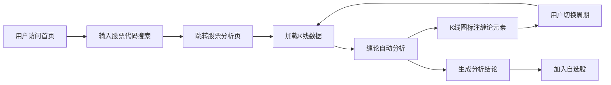

## 1. 产品概述

缠论股票分析平台是一个基于缠中说禅理论（缠论）的股票技术分析网站，为投资者提供专业的缠论自动化分析工具。平台支持输入股票代码进行快速复盘，自动识别分型、笔、线段、中枢、买卖点等缠论核心要素，辅助投资者进行技术面决策。

- 核心价值：将复杂的缠论理论自动化、可视化，降低普通投资者学习和应用缠论的门槛
- 目标用户：股票投资者、技术分析爱好者、缠论学习者
- 核心功能：股票K线图表展示、缠论自动分析、买卖点识别、中枢标记、多级别联立分析

## 2. 核心功能

### 2.1 用户角色
| 角色 | 注册方式 | 核心权限 |
|------|----------|----------|
| 游客用户 | 无需注册 | 搜索股票、查看基础缠论分析结果 |
| 注册用户 | 邮箱/手机号注册 | 保存自选股、查看完整分析报告、多级别分析 |

### 2.2 功能模块
1. **首页**：Hero区域、股票搜索框、热门股票推荐、缠论知识介绍
2. **股票分析页**：K线图表、缠论分析面板（分型/笔/线段/中枢/买卖点）、分析结论
3. **自选股页面**：自选股列表、批量查看、快速切换
4. **缠论学堂**：缠论基础教程、核心概念解释

### 2.3 页面详情
| 页面名称 | 模块名称 | 功能描述 |
|---------|----------|----------|
| 首页 | Hero区域 | 大标题、副标题、股票搜索入口、动态背景效果 |
| 首页 | 核心功能展示 | 四大核心功能卡片：分型识别、中枢构建、买卖点判断、多级别联立 |
| 首页 | 热门股票 | 实时热门股票列表，点击快速查看分析 |
| 首页 | 缠论简介 | 缠论理论介绍、核心思想说明 |
| 股票分析页 | 股票信息头 | 股票名称、代码、当前价格、涨跌幅 |
| 股票分析页 | K线图表 | 交互式K线图，支持缩放、平移，叠加缠论标记 |
| 股票分析页 | 周期切换 | 1分钟/5分钟/30分钟/日线/周线 多周期切换 |
| 股票分析页 | 分析面板 | 分型列表、笔段分析、中枢区间、买卖点标注 |
| 股票分析页 | 分析结论 | 缠论视角的操作建议、风险提示 |
| 自选股页 | 自选列表 | 已添加自选股的列表展示和快速分析入口 |
| 缠论学堂 | 教程列表 | 缠论基础概念、进阶技巧的文章列表 |

## 3. 核心流程

用户进入网站后，在首页搜索框输入股票代码或名称，系统跳转到股票分析页面，加载K线数据并自动运行缠论分析算法，在图表上标注分型、笔、线段、中枢和买卖点，同时在分析面板展示详细的分析数据和结论。用户可切换不同时间周期查看多级别联立分析结果，也可将股票加入自选股方便后续查看。

## 4. 用户界面设计

### 4.1 设计风格
- 主色调：深邃藏青 (#0A1628) 作为主背景，搭配金融金 (#D4AF37) 作为强调色
- 辅助色：上涨红 (#E74C3C)、下跌绿 (#27AE60)、中性灰 (#64748B)
- 整体风格：专业金融科技风，暗色主题，数据可视化突出
- 按钮风格：微立体按钮，圆角8px，悬停有发光效果
- 字体：标题使用 Noto Serif SC（衬线字体，体现专业感），正文使用 JetBrains Mono（等宽字体，适合数据展示）
- 布局：卡片式布局，毛玻璃效果，深色调+金色点缀营造高端金融感
- 图标风格：线性图标，金色描边，简约专业

### 4.2 页面设计概览
| 页面名称 | 模块名称 | UI元素 |
|---------|----------|-------|
| 首页 | Hero区域 | 深色渐变背景、金色大标题、搜索框发光效果、粒子动画背景 |
| 首页 | 功能卡片 | 四张特色卡片、悬浮上移动效、金色边框高光 |
| 首页 | 热门股票 | 表格布局、涨跌色标识、悬停行高亮 |
| 股票分析页 | 股票头 | 大号价格显示、涨跌幅彩色标签、周期切换标签 |
| 股票分析页 | K线图表 | 深色图表背景、K线红绿色、金色缠论标记线 |
| 股票分析页 | 分析面板 | 可折叠面板、分类标签、数据列表、结论高亮卡片 |
| 自选股页 | 股票列表 | 卡片网格、迷你K线预览、快速操作按钮 |

### 4.3 响应式
- 桌面端优先设计，适配 1440px、1920px 主流分辨率
- 平板端：侧边栏收起为图标模式，图表自适应宽度
- 移动端：单列布局，分析面板改为底部抽屉式，图表支持手势缩放

### 4.4 动效设计
- 页面加载：元素渐入+上移，错开延迟形成层次感
- K线图表：数据加载时线条绘制动画
- 卡片悬停：轻微上浮+阴影加深+金色边框发光
- 买卖点标记：脉冲闪烁动画，提示关注
- 页面切换：淡入淡出过渡
