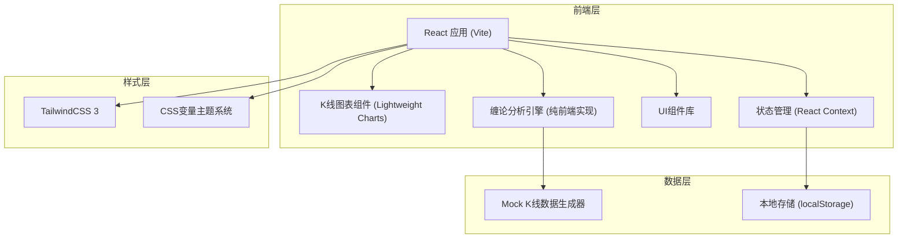

## 1. 架构设计



## 2. 技术说明

- **前端框架**: React 18 + TypeScript
- **构建工具**: Vite 5
- **样式方案**: TailwindCSS 3 + CSS 变量
- **图表库**: lightweight-charts (TradingView开源轻量K线图库)
- **路由**: React Router DOM 6
- **状态管理**: React Context + useReducer
- **缠论算法**: 纯前端TypeScript实现（分型→笔→线段→中枢→买卖点）
- **数据**: Mock数据生成器模拟真实股票K线数据
- **字体**: Noto Serif SC (标题) + JetBrains Mono (数据) + 图标使用 Lucide React

## 3. 路由定义

| 路由路径 | 页面名称 | 功能说明 |
|---------|----------|----------|
| / | 首页 | Hero区域、股票搜索、功能介绍、热门股票 |
| /analysis/:code | 股票分析页 | K线图表、缠论分析、周期切换、分析结论 |
| /watchlist | 自选股页 | 自选股列表、快速查看、管理操作 |
| /learn | 缠论学堂 | 缠论教程文章列表 |

## 4. 核心数据结构

### 4.1 K线数据结构
```typescript
interface KLineData {
  time: number;        // 时间戳
  open: number;        // 开盘价
  high: number;        // 最高价
  low: number;         // 最低价
  close: number;       // 收盘价
  volume: number;      // 成交量
}
```

### 4.2 缠论分析结果结构
```typescript
interface ChanLunResult {
  fractals: Fractal[];          // 分型
  strokes: Stroke[];            // 笔
  segments: Segment[];          // 线段
  centers: Center[];            // 中枢
  buySellPoints: BuySellPoint[]; // 买卖点
}

interface Fractal {
  index: number;       // K线索引
  type: 'top' | 'bottom'; // 顶分型/底分型
  high: number;
  low: number;
}

interface Stroke {
  startIndex: number;
  endIndex: number;
  direction: 'up' | 'down';
  startPrice: number;
  endPrice: number;
}

interface Segment {
  startIndex: number;
  endIndex: number;
  direction: 'up' | 'down';
}

interface Center {
  startIndex: number;
  endIndex: number;
  high: number;
  low: number;
  level: number;  // 中枢级别
}

interface BuySellPoint {
  index: number;
  type: 'buy1' | 'buy2' | 'buy3' | 'sell1' | 'sell2' | 'sell3';
  price: number;
}
```

### 4.3 股票信息结构
```typescript
interface StockInfo {
  code: string;
  name: string;
  currentPrice: number;
  changePercent: number;
  changeAmount: number;
}
```

## 5. 核心模块划分

| 模块 | 文件路径 | 功能描述 |
|------|---------|----------|
| 缠论引擎 | src/utils/chanlun/ | 分型识别、笔段生成、中枢构建、买卖点判断算法 |
| 数据生成 | src/utils/mock/ | Mock K线数据生成器，模拟真实股票走势 |
| K线图表 | src/components/chart/ | K线图渲染、缠论标记叠加、交互控制 |
| 首页 | src/pages/Home/ | Hero、搜索、功能卡片、热门股票 |
| 分析页 | src/pages/Analysis/ | 股票头、K线图、分析面板、结论 |
| 自选股 | src/pages/Watchlist/ | 自选股管理、列表展示 |
| 缠论学堂 | src/pages/Learn/ | 教程列表、文章展示 |
| 全局状态 | src/context/ | 自选股、主题等全局状态管理 |

## 6. 缠论算法实现方案

1. **分型识别**：遍历K线，识别顶分型（中间K线最高价最高）和底分型（中间K线最低价最低）
2. **笔的生成**：连接相邻的顶底分型，满足顶底分型之间至少有一根独立K线
3. **线段生成**：由至少三笔构成，方向由前几笔决定，处理线段破坏
4. **中枢构建**：连续三个有重叠的次级别走势类型构成中枢，计算中枢区间
5. **买卖点判断**：
   - 一买：下跌趋势最后一个中枢下方的背驰点
   - 二买：一买后回调不跌破前低的点
   - 三买：回调不进入中枢的点
   - 卖点反之

## 7. 性能优化策略

- 缠论算法使用增量计算，避免全量重算
- K线图使用Canvas渲染，轻量高效
- 大数据量时采用视口内数据渲染策略
- 使用 React.memo 和 useMemo 优化组件渲染
